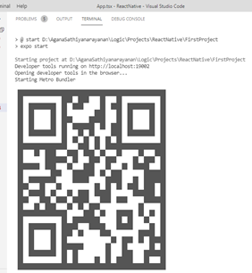
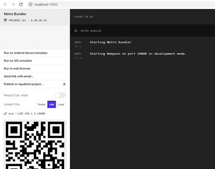

# 5Ounces2Save2
5 Ounces of Blood to Save 2 Lives
# Author: Sucheta L Sunder
This app is designed for mothers undergoing labor, who do not have the access to blood. With the control of a doctor or someone who has the app downloaded, a message will be 
sent immediately to areas nearby as well as existing Blood Banks with a request for blood supply.

# Environment Setup
## Editor
○	The editor to be used to develop ReactNative apps is VisualStudioCode.  
○	Link to download the latest version: https://code.visualstudio.com/download  
## Prerequisites
○	Download Nodejs and install: https://nodejs.org/en/download/  
○	We need to install expo cli with the help of the following command in the terminal. Environment setup link for your reference (https://reactnative.dev/docs/environment-setup)  
■	npm install -g expo-cli
 
#### Getting started with ReactNative 
○	The following link could be helpful to get started with the ReactNative basics https://reactnative.dev/docs/getting-started  

# How To Run the Application: 
●	Android mobile: install the app “Expo Go” from the PlayStore. 
●	iPhone: install the app “Camera App” from the AppStore.  
●	Open the terminal in visual studio code and please type the following command, which will install all the dependencies needed for your project. 

■ npm install  

●	Once the above command completes its execution, give the following command in the terminal which will execute your code.  

■ npm start  

●	This command will show a QR code in the terminal, You can scan the QR code from the Expo App or Camera App.This will take you to the actual application you developed on your respective mobile device.  
  
●	You will also get “Metro Builder” opening in a new tab in the browser which would look like the below pic  
  
●	You can click “Run in web browser” to test your application in the web browser as well.  

# What has been accomplished
The front end design of the form to accept requests from the user has been successfully completed.  
 
